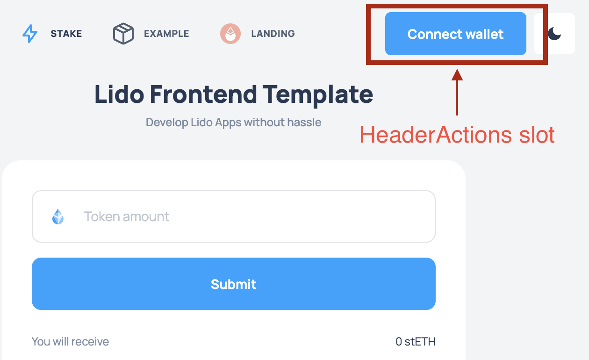

# HOW TO UPGRADE OR MAKE MIGRATION

Current Lido CI setup is built with this app template in mind.
If your project was built with custom code / fork of an older version of the staking widget,
most likely there would be changes required to make your app run smoothly.

### Step 0. Docs

READ FIRST [DOCS.md](./DOCS.md)!!!

### Step 1. Export variables in `next.config.mjs` and `env-dynamics.mjs`

Now we need to rename `next.config.js` to [next.config.mjs](./next.config.mjs),
after to change it so that we can use the variables in our application.

We will export the private variables with the `serverRuntimeConfig` and
those variables that are essential for client-side JavaScript are specified in [env-dynamics.mjs](./env-dynamics.mjs).

Note! Don't use `publicRuntimeConfig`. It is avoid problems caching variables on the client side.

### Step 2. Install Lido Warehouse packages

About **Lido Warehouse packages** you can read [here](https://github.com/lidofinance/warehouse).

It can be:

- @lidofinance/api-logger
- @lidofinance/api-metrics
- @lidofinance/next-api-wrapper
- @lidofinance/next-pages
- etc.

In the first steps to avoid some problems you should update all warehouse deps to the latest versions:

In the second steps you should install a deps:

`yarn add @lidofinance/lido-ui`

`yarn add @lidofinance/next-widget-layout`

`yarn add @lidofinance/eth-next-widget-app-evm` **(only for EVM widgets)**

`yarn add @lidofinance/eth-ui-wallet-modal` **(only for EVM widgets)**

`yarn add @lidofinance/eth-ui-primitives` **(only for EVM widgets)**

`yarn add @lidofinance/ui-primitives` **(only for EVM widgets)**

`yarn add @lidofinance/next-ui-primitives`

`yarn add reef-knot` **(only for EVM widgets)**

Also, it may be necessary install some another packages from [warehouse](https://github.com/lidofinance/warehouse).

### Step 3. Wrap \_app.tsx

`#### EVM widget`
Go to `pages/_app.tsx` and:

- wrap that using the `EVMWidgetApp` provider like [here](https://github.com/lidofinance/warehouse/tree/main/packages/eth/next/widget-app-evm#use-evm-wrapper),
- or using the `AppWagmiConfig`, `ProviderWeb3`, `ProviderWalletModal`, `WidgetApp` providers step by step like [here](https://github.com/lidofinance/warehouse/tree/main/packages/eth/next/widget-app-evm#use-evm-wrapper).

Note! `WidgetApp` contains a layouts components such as:

- `Header`,
- `Main` - page content block,
- `Footer`,
- etc.

More info [here](https://github.com/lidofinance/warehouse/tree/main/packages/next/widget-layout).

If you need a completely different layout structure - see block `Not EVM widget` below.

#### Not EVM widget

For not EVM widget we haven't a ready solution. You should make it yourself.
For that you should go to `pages/_app.tsx` and need use `widget layout components` like example [here](https://github.com/lidofinance/warehouse/tree/main/packages/next/widget-layout#getting-started),
wrap their via a specific blockchain web3 provider solution.

#### Some examples

You can find:

- In [widget layout repo](https://github.com/lidofinance/warehouse/tree/main/packages/next/widget-layout#getting-started),
- in [\_app.example_without_widget_app_wrapper.tsx](./pages/_app.example_without_widget_app_wrapper.tsx),
- in [\_app.example_hand-made_EVM_wrapper.tsx](./pages/_app.example_hand-made_EVM_wrapper.tsx)

##### About HeaderActions

Use `HeaderActions` slot to pass a `connect to wallet` button and a `see wallet` button.

You can find an example in [./components/headerActions/headerActions.tsx](./components/headerActions/headerActions.tsx).

##### About Navigation

...TODO...

### Step 4: Global styles

Don't forget to set the global styles for the project in `./pages/_app.tsx`.

Example of global styles you can find in [./components/globalStyle.ts](./components/globalStyle.ts)

### Step 5: See all PAY ATTENTION comments

You should to walk through the project where is a `PAY ATTENTION` comment and to put correct values.

There are some places:

- [./pages/\_document.tsx](./pages/_document.tsx),
- FAQ,
- [env-dynamics.mjs](env-dynamics.mjs),
- Matomo,
- allowed RPC methods,
- CSP settings,
- [./public/manifest.json](./public/manifest.json),
- etc.

_TIPS: you can use `Find in Files` on IDE!_

### Step 6: Layout for each page

For pages, you should use a components such as:

- `LayoutTitle` - h1 title,
- `LayoutSubTitle` - h2 title,
- `Section` - for separating a logically blocks.

Examples you can find here:

- [./pages/index.tsx](./pages/index.tsx)
- [./pages/example.tsx](./pages/example.tsx)

### Step 7: How to error page

For errors page such as:

- pages/404.tsx
- pages/500.tsx

You can use [@lidofinance/next-pages/ui](https://github.com/lidofinance/warehouse/tree/main/packages/next/pages)

### Step 8: Metrics

You should add a file like [./pages/api/metrics.ts](./pages/api/metrics.ts) for export metrics.

### Step 9: API helpers

All API methods, which located in `./pages/api`, you should wrap via wrappers from [@lidofinance/next-api-wrapper](https://github.com/lidofinance/warehouse/tree/main/packages/next/api-wrapper).

These wrappers provide `rate limit defender`, `cache control`, `response time metric`, `error handler` and etc.

Examples you can find here:

- [@lidofinance/next-api-wrapper](https://github.com/lidofinance/warehouse/tree/main/packages/next/api-wrapper),
- [./pages/api/mock-apr.ts](./pages/api/mock-apr.ts),
- [./pages/api/mock-lido-stats.ts](./pages/api/mock-lido-stats.ts)
